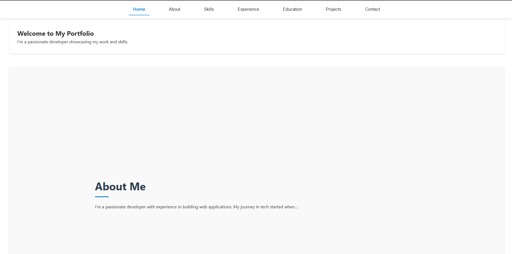

# My Portfolio


A modern, responsive, single-page scrollable portfolio built with React. Features smooth scrolling navigation, animated sections, and a clean UI.

## Features

- Single-page design with scrollable sections
- Smooth scrolling navigation
- Responsive design that works on all devices
- Interactive elements and animations
- Easy-to-customize sections:
  - Home/Introduction
  - About Me
  - Skills with progress bars
  - Work Experience timeline
  - Education background
  - Projects showcase
  - Contact form

## Technologies Used

- React.js
- React Hooks (useState, useEffect)
- CSS3 (Flexbox, Grid, custom properties)
- HTML5 semantic markup
- [Optional: any other libraries you used]

## Installation

To run this project locally:

1. Clone the repository:
   ```bash
   git clone https://github.com/yourusername/your-portfolio.git